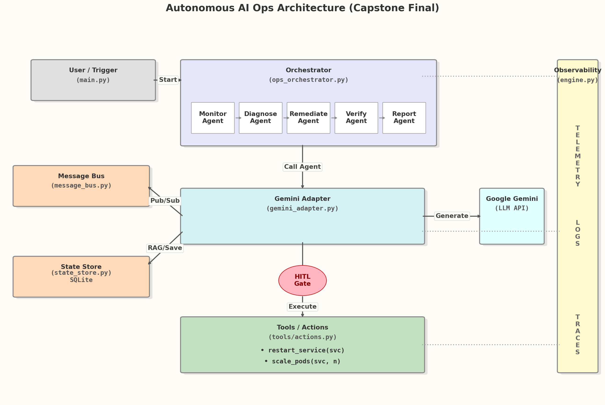

# aiops-agent
🤖 Autonomous AI Ops Engineer (Capstone Project) using the AI Operator Pattern and Gemini Flash
Enterprise Agents Track — 5-Day AI Agents Intensive (Google)
A multi-agent system that observes, diagnoses, and resolves infrastructure incidents with human-in-the-loop safety.
 
📖 Project Overview
Modern infrastructure is becoming too complex for manual management, yet traditional automation scripts are too brittle to handle "unknown unknowns."
This Capstone project implements an Autonomous AI Ops Engineer. Unlike standard chatbots, this is an agentic system that utilizes the AI Operator Pattern. It actively monitors simulated infrastructure, uses Retrieval Augmented Generation (RAG) to recall historical fixes, and executes remediation tools (like kubectl scale) to resolve incidents.
Crucially, it solves the "Runaway AI" problem by implementing a strict Human-in-the-Loop (HITL) safety gate, ensuring no destructive action occurs without engineer approval.
 
🏗️ Architecture
The system is architected as a modular, event-driven Python application, decoupling the cognitive logic (Brain) from the infrastructure execution (Hands).

 
Key Components
1.	Orchestrator: A finite state machine managing the lifecycle (Monitor → Diagnose → Remediate → Verify).
2.	Gemini Adapter: The interface to Google Gemini 2.5 Flash-Lite, handling prompt engineering and safety interception.
3.	State Store (SQLite): Persistent memory for short-term facts and long-term RAG history.
4.	Observability Engine: A custom telemetry system tracking Traces, Spans, Latency, and Token Costs.
5.	Tools Layer: Simulated infrastructure tools (restart_service, scale_pods) executing via dynamic dispatch.
 
 
✨ Key Features
Feature	Description
🧠 Cognitive Reasoning	Uses LLMs to diagnose root causes rather than matching regex patterns.
📚 RAG Memory	Queries SQLite to find how similar incidents were fixed in the past (e.g., "Scaling fixed latency in Jan").
🛡️ Safety Gate (HITL)	Pauses execution before running destructive tools (restart, scale) to wait for human Y/N  approval.
📉 Context Compaction	Automatically summarizes old incident logs when memory limits are reached to prevent context overflow.
📊 SRE Observability	Generates distributed traces and a performance dashboard (Latency & Cost) for every run.

 
📂 Repository Structure
aiops_agent/
│
├── main.py                    # Entry point; handles seeding and execution loop
├── config.py                  # Configuration (Models, DB paths)
│
├── orchestrator/              # THE BRAIN
│   └── ops_orchestrator.py    # Managing the multi-agent control loop
│
├── adapters/                  # THE INTERFACE
│   └── gemini_adapter.py      # Connects logic to LLM; Handles Safety & Tools
│
├── infrastructure/            # THE BACKEND
│   ├── message_bus.py         # In-memory Pub/Sub for agent communication
│   └── state_store.py         # SQLite database & Compaction logic
│
├── observability/             # THE EYES
│   └── engine.py              # Telemetry, Spans, and Dashboard generation
│
├── prompts/                   # THE INSTRUCTIONS
│   └── agent_prompts.py       # System prompts with negative constraints
│
└── tools/                     # THE HANDS
    └── actions.py             # Tool implementation logic
    

 
🚀 Getting Started
Prerequisites
•	Python 3.11+
•	Google Gemini API Key

Installation
1.	Clone the repository
   
        Bash
  	
        git clone https://github.com/ManishShirke/aiops-agent.git
  	
        cd aiops-agent

3.	Install Dependencies
   
        Bash
  	
        pip install -q -U google-generativeai nest_asyncio

4.	Set API Key
	
        Bash
  	
        export GOOGLE_API_KEY="your_actual_api_key_here"

6. Running the Agent

   Execute the main script to start the simulation:
   
        Bash
   
        python aiops_agent/main.py
 
 
🎬 Demo Scenario
When you run the agent, the following scenario occurs automatically:
1.	Trigger: The system simulates an alert: "payments-api experiencing latency spikes."
2.	Diagnosis: The Agent searches memory, finds that scaling pods fixed this issue previously.
3.	Plan: It proposes a plan: ["scale_pods"].
4.	Intervention:
o	The system PAUSES and displays:
o	⚠️ [APPROVAL REQUIRED] Agent wants to execute: 'scale_pods'
5.	Action: You type y (or create an approval file).
6.	Resolution: The tool executes, the system verifies the fix, and archives the result.
7.	Dashboard: A full telemetry report is printed showing latency and costs.
 
🔮 Future Roadmap
If this project were moved to production, the following enhancements would be prioritized:
1.	ChatOps Integration: Replace console input with a Slack Bot for collaborative team approvals.
2.	Vector Database: Migrate from SQLite keyword search to ChromaDB for semantic RAG (matching "slow" to "latency").
3.	Microservices: Dockerize the agents to run on Kubernetes with Prometheus triggers.
4.	Critic Agent: Add a secondary LLM to review plans against policy documents (e.g., "No restarts on Fridays") before human review.
 
👨‍💻 Author
Manish Shirke
Capstone Project - Autonomous AI Ops Engineer
Course: Google 5-Day AI Agents Intensive

